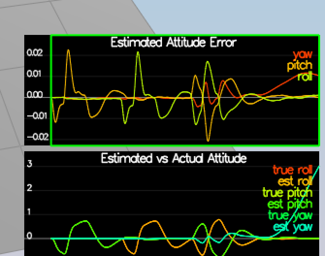
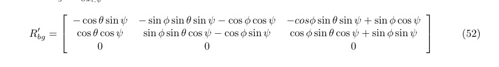
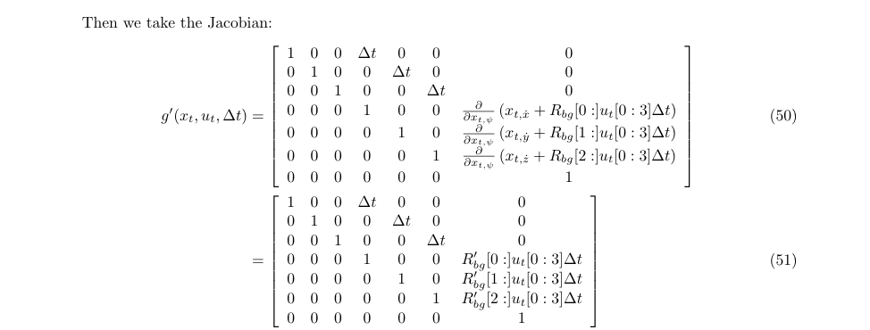
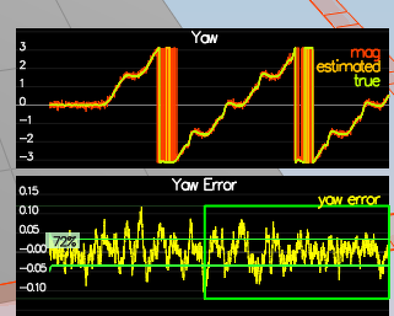

# Estimation Project #

Welcome to the estimation project.  In this project, you will be developing the estimation portion of the controller used in the CPP simulator.  By the end of the project, your simulated quad will be flying with your estimator and your custom controller (from the previous project)!

This README is broken down into the following sections:

 - [Setup](#setup) - the environment and code setup required to get started and a brief overview of the project structure
 - [The Tasks](#the-tasks) - the tasks you will need to complete for the project
 - [Tips and Tricks](#tips-and-tricks) - some additional tips and tricks you may find useful along the way
 - [Submission](#submission) - overview of the requirements for your project submission


## Setup ##

This project will continue to use the C++ development environment you set up in the Controls C++ project.

 1. Clone the repository
 ```
 git clone https://github.com/udacity/FCND-Estimation-CPP.git
 ```

 2. Import the code into your IDE like done in the [Controls C++ project](https://github.com/udacity/FCND-Controls-CPP#development-environment-setup)
 
 3. You should now be able to compile and run the estimation simulator just as you did in the controls project


### Project Structure ###

For this project, you will be interacting with a few more files than before.

 - The EKF is already partially implemented for you in `QuadEstimatorEKF.cpp`

 - Parameters for tuning the EKF are in the parameter file `QuadEstimatorEKF.txt`

 - When you turn on various sensors (the scenarios configure them, e.g. `Quad.Sensors += SimIMU, SimMag, SimGPS`), additional sensor plots will become available to see what the simulated sensors measure.

 - The EKF implementation exposes both the estimated state and a number of additional variables. In particular:

   - `Quad.Est.E.X` is the error in estimated X position from true value.  More generally, the variables in `<vehicle>.Est.E.*` are relative errors, though some are combined errors (e.g. MaxEuler).

   - `Quad.Est.S.X` is the estimated standard deviation of the X state (that is, the square root of the appropriate diagonal variable in the covariance matrix). More generally, the variables in `<vehicle>.Est.S.*` are standard deviations calculated from the estimator state covariance matrix.

   - `Quad.Est.D` contains miscellaneous additional debug variables useful in diagnosing the filter. You may or might not find these useful but they were helpful to us in verifying the filter and may give you some ideas if you hit a block.


#### `config` Directory ####

In the `config` directory, in addition to finding the configuration files for your controller and your estimator, you will also see configuration files for each of the simulations.  For this project, you will be working with simulations 06 through 11 and you may find it insightful to take a look at the configuration for the simulation.

As an example, if we look through the configuration file for scenario 07, we see the following parameters controlling the sensor:

```
# Sensors
Quad.Sensors = SimIMU
# use a perfect IMU
SimIMU.AccelStd = 0,0,0
SimIMU.GyroStd = 0,0,0
```

This configuration tells us that the simulator is only using an IMU and the sensor data will have no noise.  You will notice that for each simulator these parameters will change slightly as additional sensors are being used and the noise behavior of the sensors change.


## The Tasks ##

Once again, you will be building up your estimator in pieces.  At each step, there will be a set of success criteria that will be displayed both in the plots and in the terminal output to help you along the way.

Project outline:

 - [Step 1: Sensor Noise](#step-1-sensor-noise)
 - [Step 2: Attitude Estimation](#step-2-attitude-estimation)
 - [Step 3: Prediction Step](#step-3-prediction-step)
 - [Step 4: Magnetometer Update](#step-4-magnetometer-update)
 - [Step 5: Closed Loop + GPS Update](#step-5-closed-loop--gps-update)
 - [Step 6: Adding Your Controller](#step-6-adding-your-controller)


### Step 1: Sensor Noise ###

Calculating std using the data from `config/log/Graph1.txt` (GPS X data) and `config/log/Graph2.txt` (Accel data).
Included a python notebook [sensor_noise.ipynb](./src/sensor_noise_calc.ipynb) where the calculations are done. 
```
gps_data = np.loadtxt('../config/log/Graph1.txt',delimiter=',',dtype='Float64',skiprows=1)[:,1]
print("GPS", np.std(gps_data))

accel_data = np.loadtxt('../config/log/Graph2.txt',delimiter=',',dtype='Float64',skiprows=1)[:,1]
print("Accel", np.std(accel_data))

> GPS 0.7210370603219032
> Accel 0.5095841721693598
```


### Step 2: Attitude Estimation
Based on [Estimation for Quadrotors](https://v1.overleaf.com/read/vymfngphcccj#/54894644/)
Implementation of non-linear complimentary filter
```
  Quaternion<float> qt = Quaternion<float>::FromEulerYPR(ekfState(6), pitchEst, rollEst);
  Quaternion<float> dq;
  dq.IntegrateBodyRate(gyro, dtIMU);
  Quaternion<float> q_bar = dq * qt;
  float predictedPitch = q_bar.Pitch();
  float predictedRoll = q_bar.Roll();
  ekfState(6) = q_bar.Yaw();	// yaw


```


### Step 3

1) *Implement integration in predict step*
2) *Implement rbg_prime matrix *



```
  RbgPrime(0,0) = -cos(theta) * sin(psi);
  RbgPrime(0,1) = -sin(phi) * sin(theta) * sin(psi) - cos(phi) * cos(psi);
  RbgPrime(0,2) = -cos(phi) * sin(theta) * sin(psi) + sin(phi) * cos(psi);

  RbgPrime(1,0) = cos(theta) * cos(psi);
  RbgPrime(1,1) = sin(phi) * sin(theta) * cos(psi) - cos(phi) * sin(psi);
  RbgPrime(1,2) = cos(phi) * sin(theta) * cos(psi) + sin(phi) * sin(psi);
```
3) *Calculate jacobian*


```
  MatrixXf gPrime(QUAD_EKF_NUM_STATES, QUAD_EKF_NUM_STATES);
  gPrime.setIdentity();
  gPrime(0,3) = dt;
  gPrime(1,4) = dt;
  gPrime(2,5) = dt;
  gPrime(3,6) = dt * (RbgPrime(0) * accel).sum();
  gPrime(4,6) = dt * (RbgPrime(1) * accel).sum();
  gPrime(5,6) = dt * (RbgPrime(2) * accel).sum();
  ekfCov = gPrime*(ekfCov*gPrime.transpose()) + Q;

```


Step 4: Magnetometer Update

1) Tune Yaw
```
QYawStd = .12
```

2) Implement MagUpdate
```
hPrime(6) = 1.f;
  
  // measure
  zFromX = hPrime * ekfState;
  
  // normalise
  if (magYaw - zFromX[0] > F_PI) {
    zFromX[0] += 2 * F_PI;
  }
  if (magYaw - zFromX[0] < -F_PI) {
    zFromX[0] -= 2 * F_PI;
  }
```

