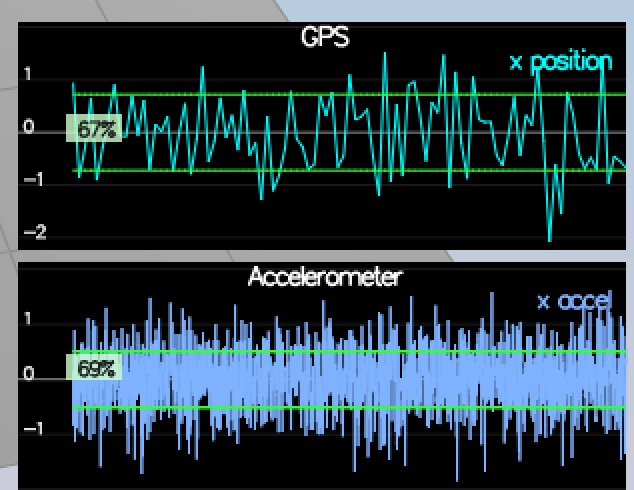

# Estimation Project #

This is an implementation of Udacity Flying cars final project. Broken into individual steps and separate commits for each step.

 - [Step 1: Sensor Noise](#step-1-sensor-noise)
 - [Step 2: Attitude Estimation](#step-2-attitude-estimation)
 - [Step 3: Prediction Step](#step-3-prediction-step)
 - [Step 4: Magnetometer Update](#step-4-magnetometer-update)
 - [Step 5: Closed Loop + GPS Update](#step-5-closed-loop--gps-update)
 - [Step 6: Adding Your Controller](#step-6-adding-your-controller)


### Step 1: Sensor Noise ###

Calculating std using the data from `config/log/Graph1.txt` (GPS X data) and `config/log/Graph2.txt` (Accel data).
Included a python notebook [sensor_noise.ipynb](./src/sensor_noise_calc.ipynb) where the calculations are done. 
```
gps_data = np.loadtxt('../config/log/Graph1.txt',delimiter=',',dtype='Float64',skiprows=1)[:,1]
print("GPS", np.std(gps_data))

accel_data = np.loadtxt('../config/log/Graph2.txt',delimiter=',',dtype='Float64',skiprows=1)[:,1]
print("Accel", np.std(accel_data))

> GPS 0.7210370603219032
> Accel 0.5095841721693598
```


### Step 2: Attitude Estimation
Based on [Estimation for Quadrotors](https://v1.overleaf.com/read/vymfngphcccj#/54894644/)
Implementation of non-linear complimentary filter
```
  Quaternion<float> qt = Quaternion<float>::FromEulerYPR(ekfState(6), pitchEst, rollEst);
  Quaternion<float> dq;
  dq.IntegrateBodyRate(gyro, dtIMU);
  Quaternion<float> q_bar = dq * qt;
  float predictedPitch = q_bar.Pitch();
  float predictedRoll = q_bar.Roll();
  ekfState(6) = q_bar.Yaw();	// yaw


```


### Step 3: Prediction Step

1) *Implement integration in predict step*
2) *Implement rbg_prime matrix *


```
  RbgPrime(0,0) = -cos(theta) * sin(psi);
  RbgPrime(0,1) = -sin(phi) * sin(theta) * sin(psi) - cos(phi) * cos(psi);
  RbgPrime(0,2) = -cos(phi) * sin(theta) * sin(psi) + sin(phi) * cos(psi);

  RbgPrime(1,0) = cos(theta) * cos(psi);
  RbgPrime(1,1) = sin(phi) * sin(theta) * cos(psi) - cos(phi) * sin(psi);
  RbgPrime(1,2) = cos(phi) * sin(theta) * cos(psi) + sin(phi) * sin(psi);
```
3) *Calculate jacobian*


```
  MatrixXf gPrime(QUAD_EKF_NUM_STATES, QUAD_EKF_NUM_STATES);
  gPrime.setIdentity();
  gPrime(0,3) = dt;
  gPrime(1,4) = dt;
  gPrime(2,5) = dt;
  gPrime(3,6) = dt * (RbgPrime(0) * accel).sum();
  gPrime(4,6) = dt * (RbgPrime(1) * accel).sum();
  gPrime(5,6) = dt * (RbgPrime(2) * accel).sum();
  ekfCov = gPrime*(ekfCov*gPrime.transpose()) + Q;

```


### Step 4: Magnetometer Update

1) Tune Yaw
```
QYawStd = .12
```

2) Implement MagUpdate
```
hPrime(6) = 1.f;
  
  // measure
  zFromX = hPrime * ekfState;
  
  // normalise
  if (magYaw - zFromX[0] > F_PI) {
    zFromX[0] += 2 * F_PI;
  }
  if (magYaw - zFromX[0] < -F_PI) {
    zFromX[0] -= 2 * F_PI;
  }
```


### Step 5: Closed Loop + GPS Update

Based on [Estimation for Quadrotors](https://v1.overleaf.com/read/vymfngphcccj#/54894644/)

```
  hPrime.setIdentity();
  zFromX(0) = ekfState(0);
  zFromX(1) = ekfState(1);
  zFromX(2) = ekfState(2);
  zFromX(3) = ekfState(3);
  zFromX(4) = ekfState(4);
  zFromX(5) = ekfState(5);

```


### Step 6: Adding Your Controller

After replacing with real controller gps position still seems to be pretty good.

